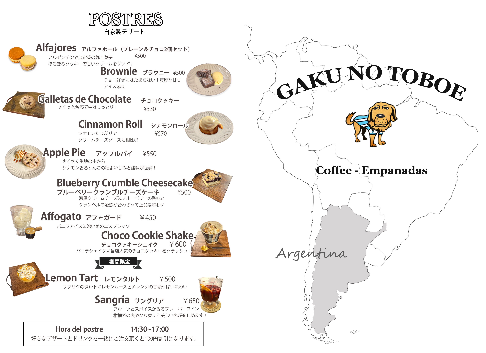
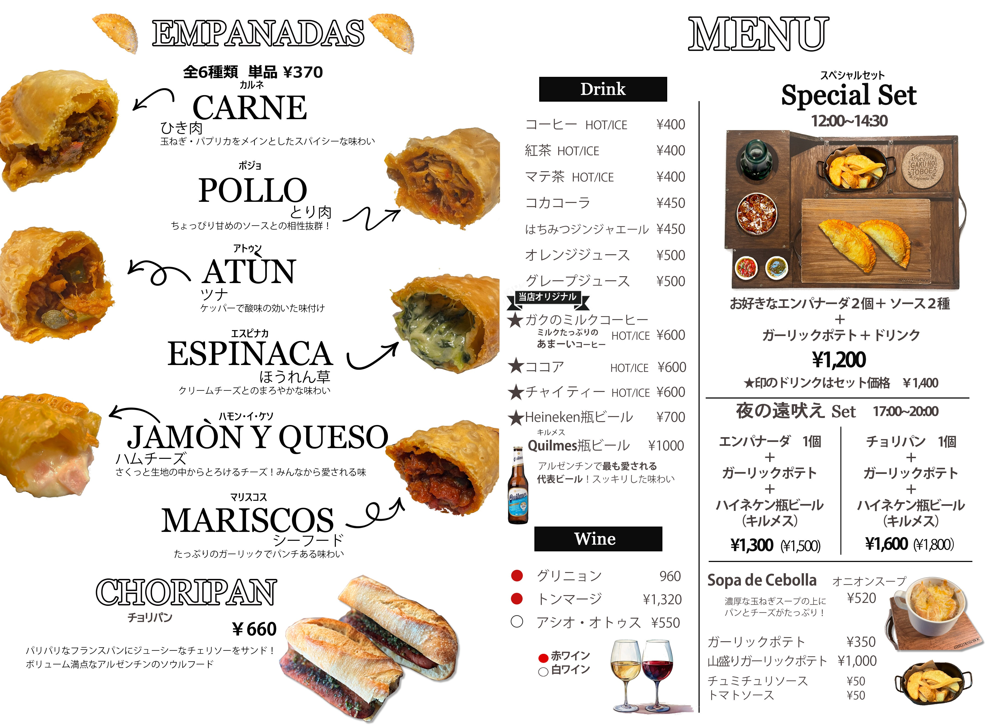

<!DOCTYPE html>
<html lang="ja">
<head>
    <link href="https://fonts.googleapis.com/css2?family=Kaisei+Decol&display=swap" rel="stylesheet">
    <meta charset="UTF-8">
    <meta name="viewport" content="width=device-width, initial-scale=1.0">
    <title>GAKU NO TOBOE</title>
    <link href="https://fonts.googleapis.com/css2?family=Pacifico&display=swap" rel="stylesheet">
    
</head>
<body>

<header>
    <h1>GAKU NO TOBOE</h1>
    <nav>
        <a href="#news">お知らせ</a>
        <a href="#menu">メニュー</a>
        <a href="#history">ヒストリー</a>
        <a href="#sns">SNS</a>
        <a href="#access">アクセス</a>
        <a href="#gallery">ギャラリー</a>
    </nav>
</header>

<section id="news">
    <h2>お知らせ</h2>
    
最新情報やイベント情報をこちらでお知らせします。

    

        
    

</section>

<section id="menu">
    <h2>メニュー</h2>
    
自家製エンパナーダや自家製デザートで非日常を体験できます。

    

        
    

    

        

            
            
☝拡大するよ

        

        

            
            
☝拡大するよ

        

    

</section>

<section id="history">
    <h2>ヒストリー</h2>
    
GAKU NO TOBOEの歴史やこだわりをご紹介します。

    

        
    

        
    

</section>

<section id="sns">
    <h2>SNS</h2>
    
最新情報やカフェの雰囲気をSNSでチェックしましょう！

    

        <a href="https://www.instagram.com/gaku_no_toboe" target="_blank" style="text-decoration: none; color: #d4af37; font-size: 1.5em;">Instagram</a>
        <a href="https://www.tiktok.com/@gaku.no.toboe_empanadas?_t=ZS-8tgKcjiQMnF&_r=1" target="_blank" style="text-decoration: none; color: #d4af37; font-size: 1.5em;">TikTok</a>
    

</section>

<section id="access">
    <h2>アクセス</h2>
    
藤沢市亀井野にある隠れ家カフェへようこそ　最寄り駅 六会日大前

    
〒251-0813 神奈川県藤沢市亀井野809-13

    
駐車場3台　ワンちゃん利用可能なテラス有

</section>

<section id="gallery" class="gallery">
    <h2>ギャラリー</h2>
    
カフェの魅力的な写真をお楽しみください。

    

        
        
        
    

</section>

<footer>
    
&copy; 2025 GAKU NO TOBOE

</footer>

</body>
</html>
